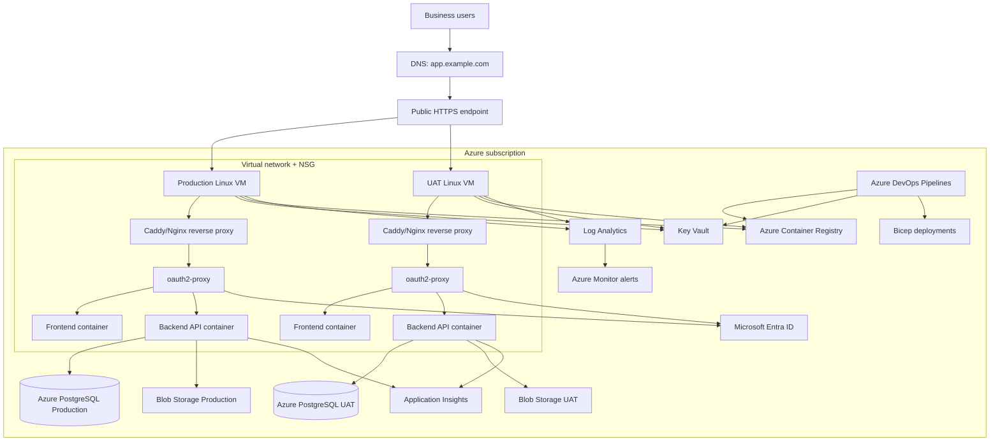

# 02 Target Architecture

## Final Architecture

Use a simple VM + Docker Compose architecture:

- Azure DevOps Repos and Pipelines build immutable Docker images.
- Azure Container Registry stores versioned images.
- Separate UAT and Production Linux VMs run Docker Compose.
- Caddy or Nginx is the only public container.
- `oauth2-proxy` performs Microsoft Entra ID OIDC sign-in and injects trusted identity headers.
- Backend validates the proxy shared secret and role headers.
- Azure Database for PostgreSQL Flexible Server stores business data.
- Key Vault stores secrets.
- Managed Identity lets VMs pull from ACR and read Key Vault.
- Log Analytics/Application Insights/Azure Monitor provide observability.

This keeps the system maintainable for one developer while avoiding AKS, multi-VM HA, and blue-green complexity.

## Mermaid Diagram

## Component Rationale

- Linux VM: simplest durable host for Docker Compose; replaceable.
- Docker Compose: simple versioned deployment and rollback using image tags.
- Caddy/Nginx: only public listener; terminates HTTPS and forwards internal traffic.
- oauth2-proxy: OIDC with Entra ID without rewriting the SPA immediately.
- Backend API: Express service on internal Docker network only.
- Frontend: static Vite build served by frontend container or reverse proxy.
- PostgreSQL Flexible Server: matches current `pg` and SQL migrations.
- Blob Storage: target for future durable uploaded/generated files; current SAP upload is parsed in memory and not retained.
- Key Vault: stores secrets such as DB URL, OIDC client secret, proxy cookie secret, backend proxy secret.
- Managed Identity: VM retrieves secrets and pulls images without embedded credentials.
- Application Insights / Log Analytics: app, VM, and deployment observability.

## Optional Front Door

Use Azure Front Door Standard + WAF only if the app is internet-facing or needs global edge/WAF features. For an internal-only app over corporate VPN/private access, it is optional and likely unnecessary at launch.

